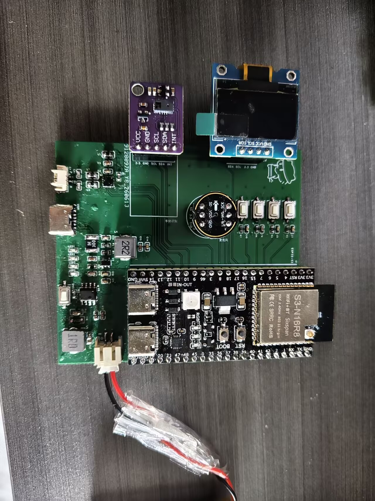
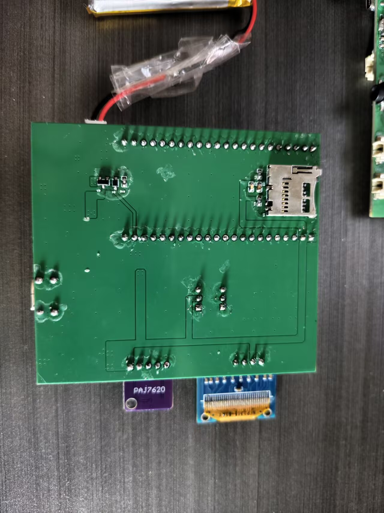

# ESP32-S3 AI Smart Speaker

An ESP-IDF smart-speaker project built around the ESP32-S3, with an INMP441 digital microphone, MAX98357A I2S amplifier, SSD1306 OLED, PAJ7620 gesture sensor, MicroSD storage, and a LubanCat A0 running Ubuntu as the LAN music server.

## Highlights

- ESP-SR WakeNet local wake-word detection
- 16 kHz mono I2S microphone capture and 60 ms Opus encoding
- XiaoZhi OTA discovery, WebSocket audio transport, and MCP tool handling
- Opus TTS decoding, 24 kHz to 16 kHz resampling, and I2S playback
- HTTP MP3/WAV streaming from the LubanCat A0, including prefetch and automatic track switching
- WAV recording and playback through MicroSD
- OLED status display, button controls, and PAJ7620 gesture controls
- FreeRTOS event queue and state-based audio-source arbitration

## Hardware prototype

<table>
  <tr>
    <td align="center"></td>
    <td align="center"></td>
  </tr>
  <tr>
    <td align="center">Front assembly: ESP32-S3, OLED, PAJ7620 and controls</td>
    <td align="center">Back side: soldering and MicroSD/TF card socket</td>
  </tr>
</table>

## Repository layout

```text
hardware/                  Schematic, PCB project, BOM, and revision notes
software/Bluetooth-Speaker ESP32-S3 ESP-IDF firmware
方案计划/                   Hardware design and system-planning documents
```

## Audio paths

```text
Voice uplink:
INMP441 -> I2S RX -> 16-bit PCM -> Opus -> WebSocket -> voice service

TTS downlink:
WebSocket -> Opus decode -> 24 kHz/16 kHz resample -> I2S TX -> MAX98357A

LAN music:
LubanCat A0 HTTP server -> MP3/WAV stream -> decode/resample -> I2S TX -> MAX98357A
```

## Quick start

Requirements:

- ESP-IDF with ESP32-S3 support
- An ESP-SR WakeNet model partition
- Hardware wiring matching the defaults in `sdkconfig.defaults`

```bash
cd software/Bluetooth-Speaker
idf.py set-target esp32s3
idf.py build
idf.py -p <SERIAL_PORT> flash monitor
```

Local settings are stored in the generated `sdkconfig`, which is intentionally ignored. Start from `software/Bluetooth-Speaker/sdkconfig.defaults`, then use `idf.py menuconfig` to set deployment-specific values such as the LubanCat address and Wi-Fi provisioning proof of possession.

## LubanCat A0 music server

On the LubanCat A0 Ubuntu system, place development audio files in a server directory and expose it on the LAN, for example:

```bash
python3 -m http.server 8081 --directory /path/to/music
```

Configure the firmware URL as:

```text
http://<LUBANCAT_IP>:8081/example.mp3
```

Do not commit real Wi-Fi credentials, private tokens, device activation data, or deployment-specific server addresses.

## Notes

The repository does not include copyrighted music files, generated build output, private credentials, or local resume/document-rendering artifacts.
